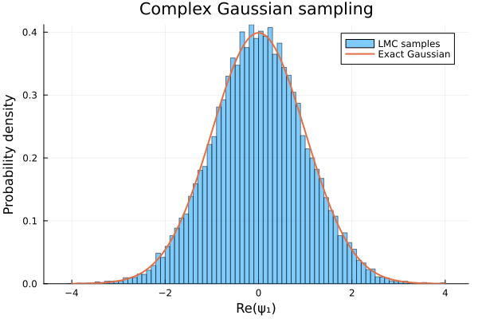

## Description
This package is optimized for relatively high-dimensional complex vectors commonly encountered in physics. Nevertheless, we demonstrate its usage with a single complex variable.

The ReplicaExchange.jl package is required. Since neither package is currently registered in the Julia General Registry, install them directly from GitHub using Pkg.develop:

```julia
using Pkg

Pkg.develop(url="https://github.com/yeongjunk/ReplicaExchange.jl")
Pkg.develop(url="https://github.com/yeongjunk/LMC.jl")
```

## Example

```julia
using Random
using LMC
using Plots
# H(ψ) = 1/2 ∑ᵢ |ψᵢ|²
function energy(ψ)
    E = 0.0

    @inbounds @simd for i in eachindex(ψ)
        E += abs2(ψ[i])
    end

    return E / 2
end

function gradient!(ψ, grad)
    @inbounds @simd for i in eachindex(ψ, grad)
        grad[i] = ψ[i] / 2
    end

    return nothing
end

function energy_and_gradient!(ψ, grad)
    E = 0.0

    @inbounds @simd for i in eachindex(ψ, grad)
        grad[i] = ψ[i] / 2
        E += abs2(ψ[i])
    end

    return E / 2
end

function run_steps!(params, state, rng, n_steps)
    n_accepts = 0

    for _ in 1:n_steps
        n_accepts += LMC.lmc_step!(params, state; rng)
    end

    return n_accepts
end

function collect_samples!(
    samples,
    params,
    state,
    rng,
    sample_every,
)
    n_accepts = 0

    for i in eachindex(samples)
        for _ in 1:sample_every
            n_accepts += LMC.lmc_step!(params, state; rng)
        end

        samples[i] = real(state.ψ[1])
    end

    return n_accepts
end

function main()
    rng = Xoshiro(1234)
    n_variables = 16

    problem = ProblemWithEG(
        gradient!,
        energy,
        energy_and_gradient!,
    )

    beta = 1.0
    epsilon = 0.05
    sigma = sqrt(2epsilon)

    params = LMCParams(problem, beta, epsilon, sigma)
    state = LMCState(zeros(ComplexF64, n_variables))

    # Compilation and initialization
    run_steps!(params, state, rng, 10)

    # Performance measurement
    n_steps = 100_000

    stats = @timed run_steps!(
        params,
        state,
        rng,
        n_steps,
    )

    println("Steps:           ", n_steps)
    println("Elapsed time:    ", round(stats.time; digits=4), " s")
    println("Acceptance rate: ", round(stats.value / n_steps; digits=4))
    println("Allocated bytes: ", stats.bytes)

    # Sampling for visualization
    n_samples = 20_000
    sample_every = 10
    samples = Vector{Float64}(undef, n_samples)

    collect_samples!(
        samples,
        params,
        state,
        rng,
        sample_every,
    )

    gaussian(x) = sqrt(beta / (2π)) * exp(-beta * x^2 / 2)

    p = histogram(
        samples;
        bins=80,
        normalize=:pdf,
        alpha=0.5,
        label="LMC samples",
        xlabel="Re(ψ₁)",
        ylabel="Probability density",
        title="Complex Gaussian sampling",
    )

    plot!(
        p,
        gaussian,
        -4,
        4;
        linewidth=2,
        label="Exact Gaussian",
    )

    savefig(p, "gaussian.png")
    println("Saved plot: gaussian.png")

    return state
end

state = main()
```

### Output

```text
Steps:           100000
Elapsed time:    0.0104 s
Acceptance rate: 0.6175
Allocated bytes: 0
Saved plot: gaussian.png
```


